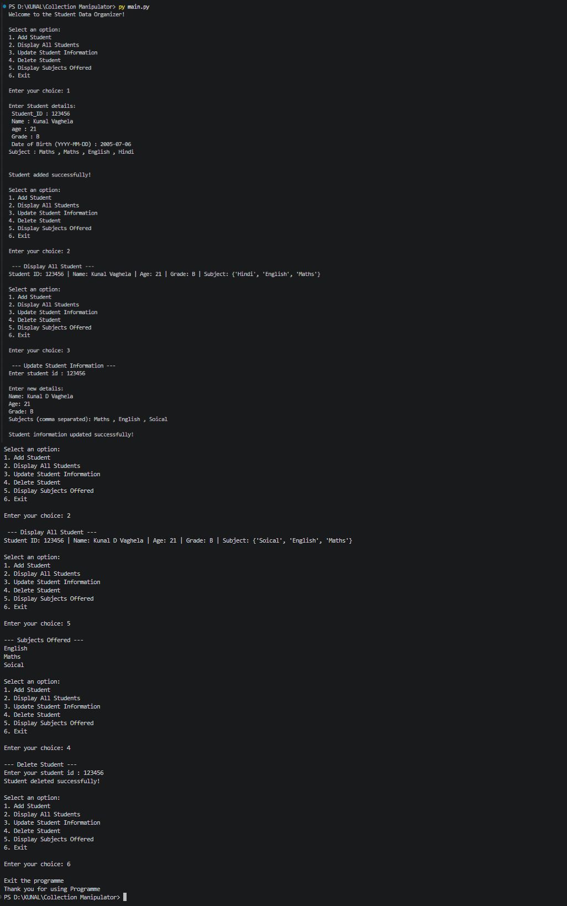

# 📚 Collection Manipulator :

## 📖 Project Description

The **Student Data Organizer** is a comprehensive command-line application built with Python that enables efficient management of student records. This system is designed for educational institutions, schools, and colleges to maintain, organize, and manipulate student information with a simple yet powerful menu-driven interface. The application implements CRUD (Create, Read, Update, Delete) operations, making it easy to handle student data operations seamlessly.

---

## ✨ Features

✅ **Add Student** - Register new students with complete information
- Store Student ID, Name, Age, Grade, Date of Birth
- Add multiple subjects for each student
- Automatic duplicate subject elimination using sets

📋 **Display All Students** - View complete student database
- Shows all registered students in formatted output
- Displays ID, Name, Age, Grade, and Subjects
- Easy-to-read tabular format

✏️ **Update Student Information** - Modify existing student records
- Search students by Student ID
- Update any student field (Name, Age, Grade, Subjects)
- Maintains data integrity during updates

🗑️ **Delete Student** - Remove student records
- Delete students by their unique Student ID
- Permanent removal from database
- Confirmation messages for user feedback

📚 **Display Subjects Offered** - View all unique subjects
- Shows all subjects across all students
- Automatically removes duplicates
- Alphabetically sorted display
- Identifies if database is empty

🎯 **User-Friendly Menu** - Simple navigation system
- Clear menu options at each step
- Input validation for menu selection
- Error handling for invalid entries

---

## 🛠️ Technologies Used

| Technology | Purpose | Usage |
|-----------|---------|-------|
| **Python 3.x** | Programming Language | Core application development |
| **Dictionary** | Data Structure | Store individual student information |
| **List** | Data Structure | Maintain multiple student records |
| **Set** | Data Structure | Store unique subjects efficiently |
| **Tuple** | Data Structure | Store immutable student ID and DOB pairs |
| **While Loop** | Control Flow | Continuous menu system |
| **For Loop** | Iteration | Traverse student list and data |
| **String Methods** | Data Processing | Input processing and formatting |

---

## 🚀 How to Run / Installation

### 📋 Prerequisites
- Python 3.6 or higher installed on your system
- Text editor or IDE (VS Code, PyCharm, etc.)
- Basic command-line/terminal knowledge
- Windows, macOS, or Linux operating system

### 📥 Installation Steps

**Step 1: Download/Clone the Project**
```bash
# If using git
git clone <repository-url>
cd student-data-organizer

# Or simply download and extract the zip file
# Navigate to the project folder
```

**Step 2: Verify Python Installation**
```bash
# Check Python version
python --version
# or
python3 --version
```

**Step 3: Navigate to Project Directory**
```bash
# Windows
cd C:\path\to\student-data-organizer

# macOS/Linux
cd /path/to/student-data-organizer
```

**Step 4: Run the Application**
```bash
# Method 1
python main.py

# Method 2
python3 main.py

# Method 3 (Direct execution on Linux/macOS)
./main.py
```

**Step 5: Follow the Menu**
```
Select an option (1-6):
1 - Add a new student
2 - Display all students
3 - Update student information
4 - Delete a student
5 - View all subjects
6 - Exit the program
```

---

## 📁 Project Structure

```
├── main.py
├──README.md
└──output.png
```
## 📸 output / screenshots :


---

## 👨‍💻 Author / Developer Name

### **Kunal Vaghela** 🚀


---

